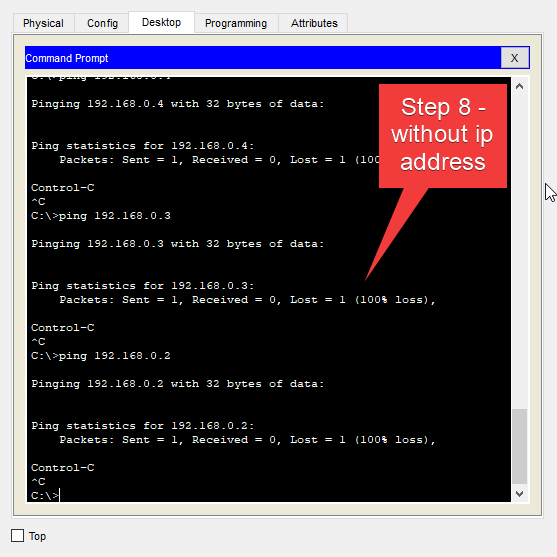
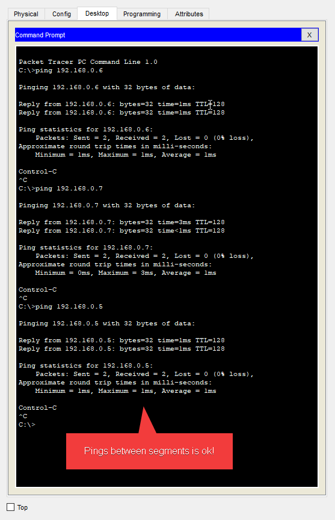
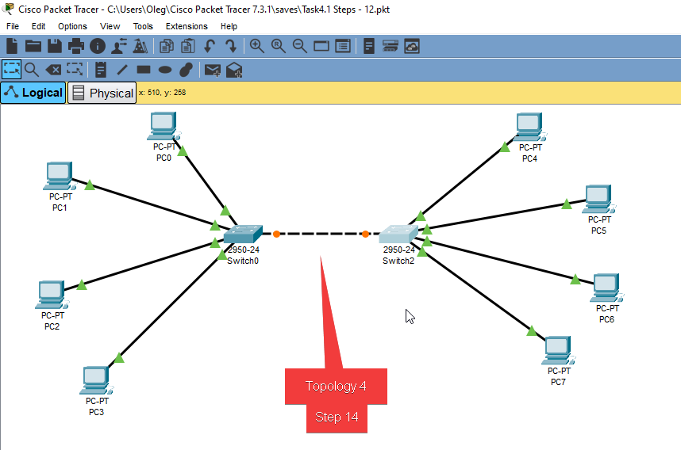
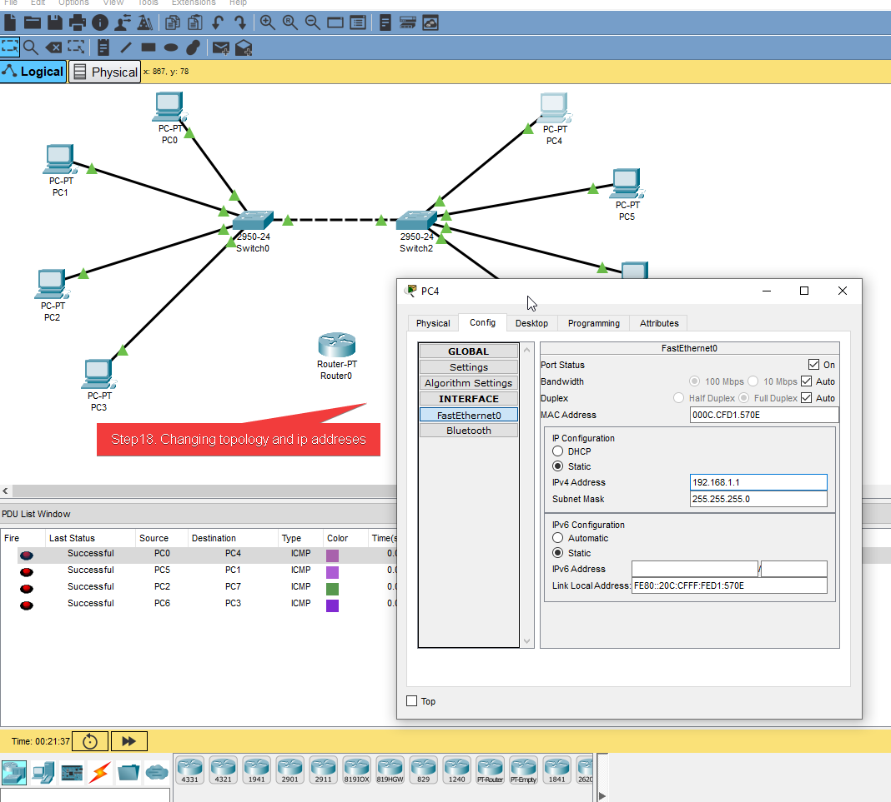

# Task 4.1

## Cisco Packet Tracer files:
[link to cpt files](./Cptfiles/Task4.1_Steps-1-7.pkt)
###
[link to cpt files](./Cptfiles/Task4.1_Steps-8-11.pkt)
###
[link to cpt files](./Cptfiles/Task4.1_Steps-12-13.pkt)
###
[link to cpt files](./Cptfiles/Task4.1_Steps-14-23.pkt)

