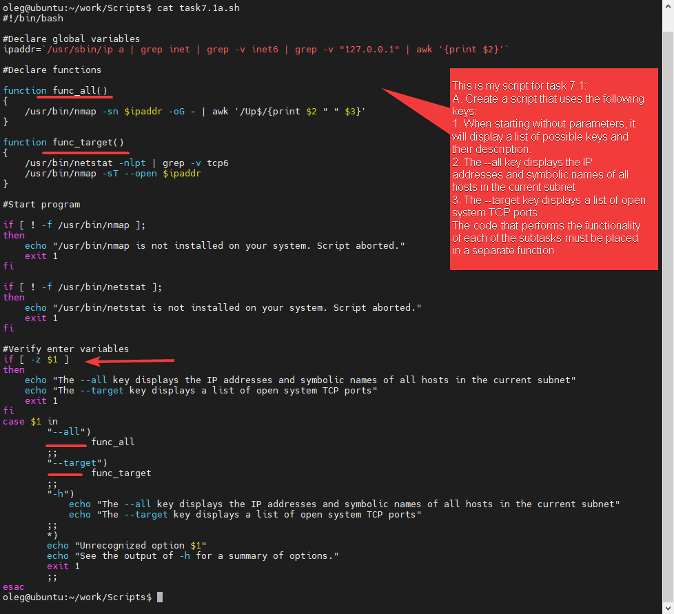
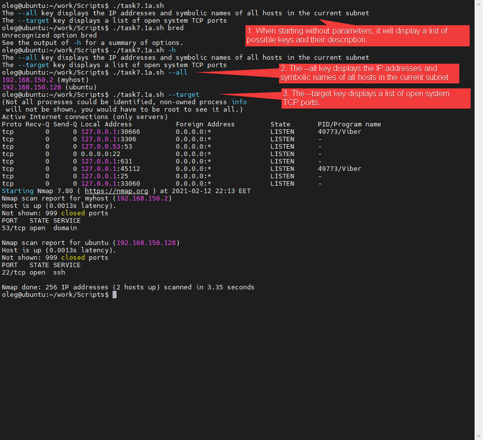
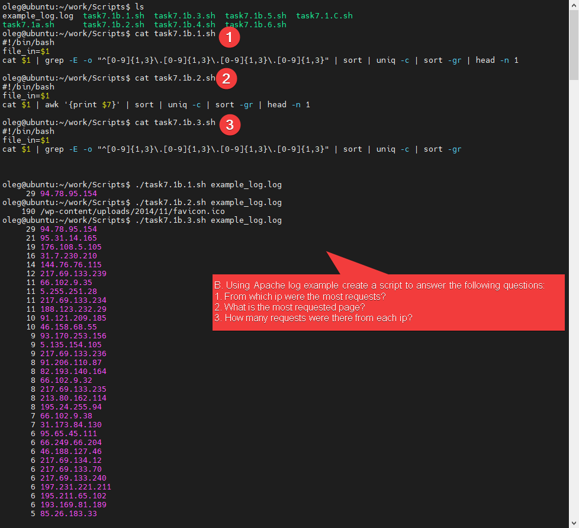
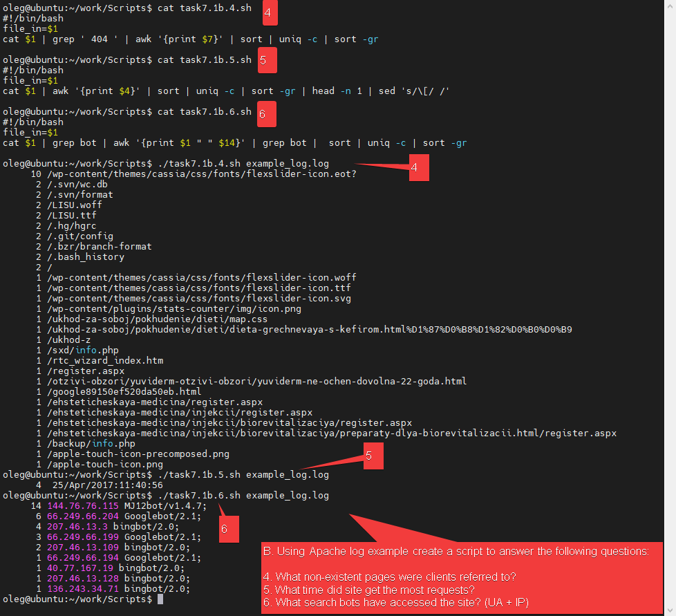
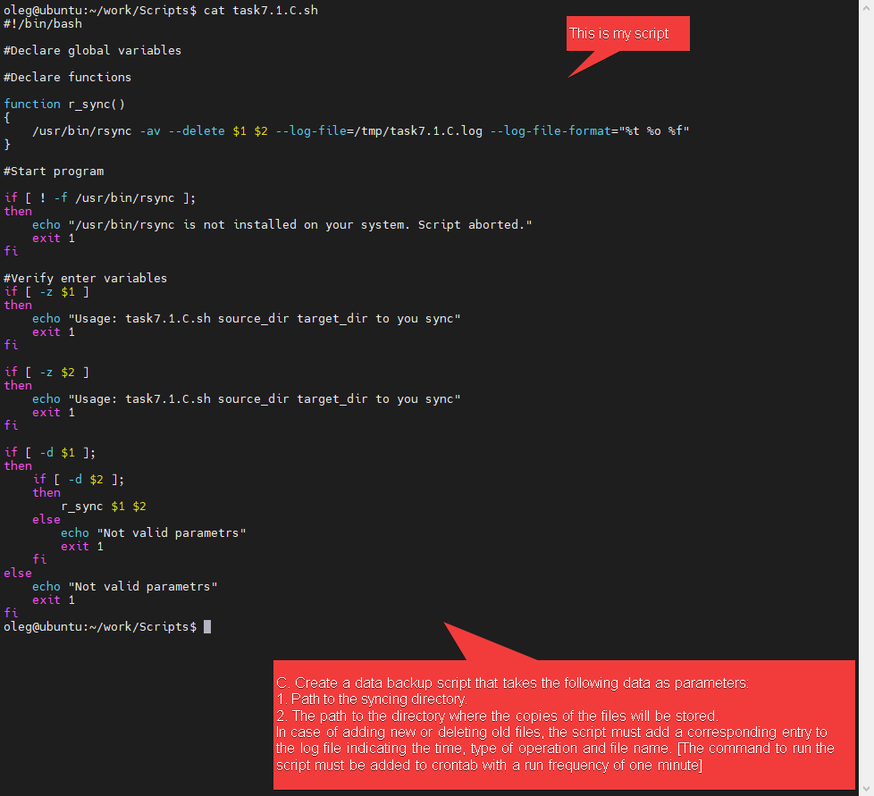
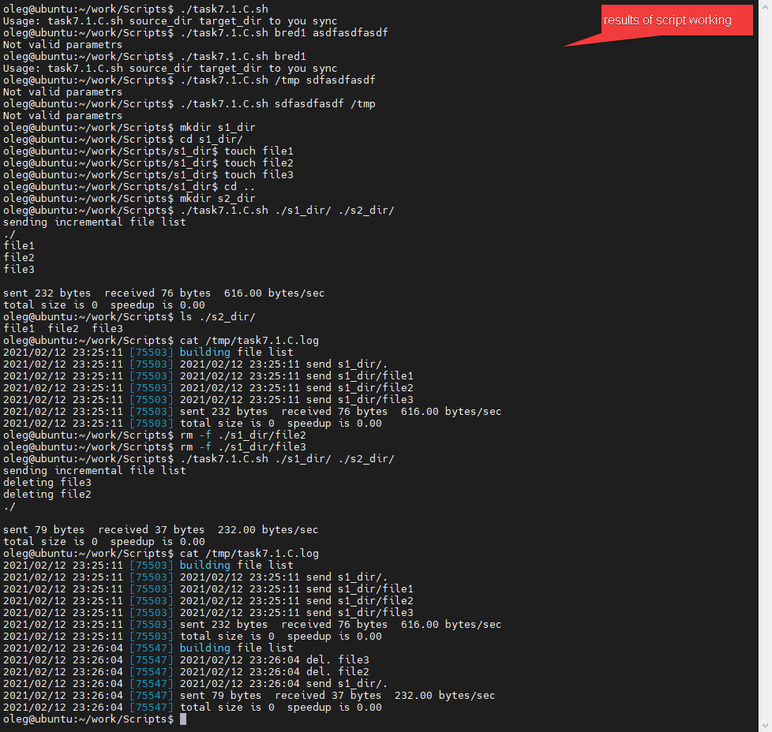

# Task 7.1

## There is path to Script for  Task 7.1.a
[link to task7.1a.sh](./Scripts/task7.1a.sh)
#
[link to task7.b.1.sh](./Scripts/task7.1b.1.sh)
#
[link to task7.b.2.sh](./Scripts/task7.1b.2.sh)
#
[link to task7.b.3.sh](./Scripts/task7.1b.3.sh)
#
[link to task7.b.4.sh](./Scripts/task7.1b.4.sh)
#
[link to task7.b.5.sh](./Scripts/task7.1b.5.sh)
#
[link to task7.b.6.sh](./Scripts/task7.1b.6.sh)
#
[link to task7.1.C.sh](./Scripts/task7.1.C.sh)
